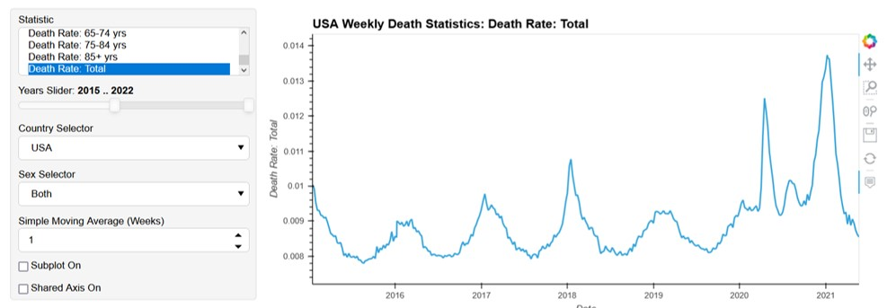

# Covid Data Visualization Dashboard

# Visualization Code for Country Mortality and COVID-19

# Contributors
* Glen 
* Jesus
* Scott

# Project Summary:
Our project focuses on what we believe are a few major deficiencies in how COVID-19 statistics are presented on most major dashboards:
* Lack of excess deaths
* Unable to compare country/state statistics
* Overcomplicated and/or cluttered plots

Our dashboard is a helpful tool for visualizing the significant impact that the COVID-19 Pandemic had on multiple countries and their respective death total and death rate. 

Age demographics for this dashboard are the following:
* 0-14 yrs
* 15-64 yrs
* 65-74 yrs
* 75-84 yrs
* 85+ yrs

Countries included in this dashboard:

Australia, Austria, Belgium, Bulgaria, Canada, Switzerland, Chile, Czech Republic, Germany, Denmark,
Spain, Estonia, Finland, France, England and Wales, Northern Ireland, Scotland, Greece, 
Croatia, Hungary, Iceland, Israel, Italy, South Korea, Lithuania, Luxembourg, Latvia, 
Netherlands, Norway, New Zealand, Poland, Portugal, Russia, Slovakia, Slovenia, Sweden, Taiwan, USA

## Libraries used:
* Panel
* hvPlot
* Pandas
* Mathplotlib
* Geopy
* Seaborn

## Link to Presentation
[Dashboard Visualizations for Country Mortality
And COVID-19](https://docs.google.com/presentation/d/1HCXKw-G2MO_-SUf69u6XDQCkMVT7jiKRqAI4lBNssz0/edit#slide=id.p)

>>>>>>> 6629748d56add318b685301596f14572635e4338
